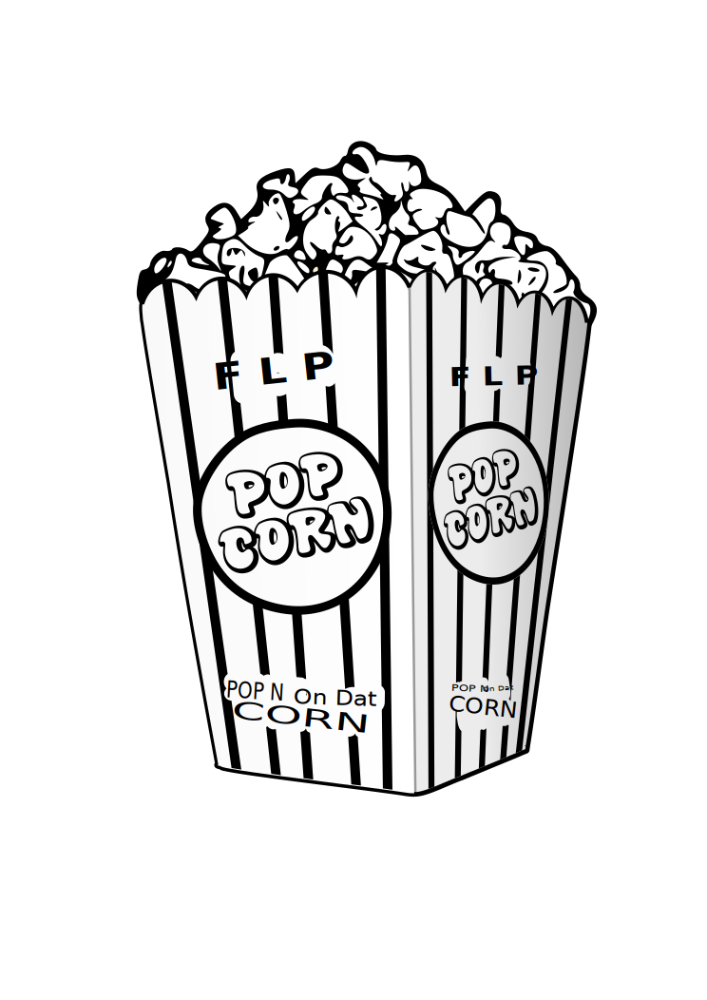

# theetr (Coding Challenge)
### Check it out <a href='theetr.herokuapp.com'>HERE!</a> (deployed on heroku)

## Development Process
* Database Model - This is really the most important step. Good SQl modeling builds the foundation of your
  entire application. If you model your relationships well in the database, then 
  all your application has to do is extract the information. Business logic and requirements dictate the model, so this step
  is reading problem description and translating it to SQL db model.

* CRUD for DB Models - Normally in my role I never use scaffolding, and I don't like how it
bloats an application. I also think using it might not demonstrate my abilities as well as doing
  the steps manually for setting up migrations, controllers, models, views..etc. However, the tools
  are nice and this is needs to be built efficiently.
  
* Front-end/Styling - This app was built with a mobile-first mindset, utilizing flexbox for responsive pages, without needing media queries.
  In regards to styling: I wanted to try something different, and also wanted to roll my own. I'm generally pleased with the result.
  
* Further Enhancements - It would be really nice to add some modals, this app is very bare-bones with regards to javascript, and this
dynamic feature would add a lot to the user by not having to visit separate pages. 
  
## Preview
### Desktop (in customer view)

### Mobile (in admin view)

### Email Receipt

  

